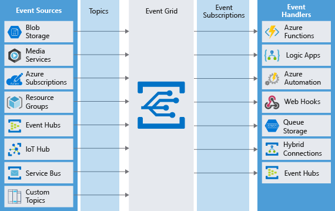

# Event Grid.

## Обзор
Предназначено для обмена событиями (event), а не сообщениями (message). Событие сигнализирует о 
том, что что-то случилось и на это нужно отреагировать, т.е. одна сущность оповещает другую 
сущность о том, что что-то случилось и другая сущность должна отреагировать.
Можно выделить следующие компоненты, на базе которых строиться процесс обмена сообщениями:
* Event - само событие, которое должно соответствовать схеме, описанной в этом документе https://learn.microsoft.com/en-us/azure/event-grid/event-schema
* Publisher - пользователь или организация, которые отправляют Event. Этому 
  пользователю/организации принадлежит сервис.
* Event Source - место, в котором случилось событие, т.е. это название приложения или сервиса
* Topic - эндпоинт, в который Event Source посылает Event. Event Source может посылать сообщение 
  в одни Topic или в несколько Topic-ов. Subscriber решает из какого Topic-а/-ов оно будет читать
* Event Subscription - способ, которым мы информируем Event Grid о том, какие Event-ы нам 
  интересны. Это ендпоинт получения сообщений. Event Subscription тоже строго должно 
  соответствовать схеме
* Event Handler - сущность, которая обрабатывает события. Программа, которой заинтересована в 
  прослушивании приходящих событий. Может быть:
  * внешние приложения
  * приложения, развернутые внутри облака
  * WebHook-и
* Security - сущность, которая предоставляет:
  * аутентификацию
  * авторизацию
* Event Delivery - в случае, если Event Handler не может обработать сообщение прямо сейчас, то 
  Event Grid не будет пробовать доставить событие непрерывно. По началу Event Grid попробует 
  доставить через 10 секунд, потом через 30 и т.д по возрастанию (1 мин., 5 мин., 10 мин., 30 
  мин., 1 час, 2 часа и т.д с интервалом в 1 час). Максимальный период доставки - 24 часа. Это 
  дефолтное поведение и его можно настраивать. Если доставить не получилось, то Event Grid 
  считает, что Event Handler умер и появляется сущность Dead Letter - событие, которое так и не 
  удалось доставить. Оно отправляется в storage account (покуда не понимаю, что это). По 
  умолчанию настройка хранения Dead Letter выключена - если Dead Letter важны, то ее нужно 
  включить, создать storage account и направить Event Grid на этот storage account.

Хороший обзор приведен в статье официального обучающего курса [Choose Azure Event Grid](https://learn.microsoft.com/en-us/training/modules/choose-a-messaging-model-in-azure-to-connect-your-services/4-choose-event-grid)

## Event Grid. Область применения
Большинство типов компонентов MS Azure имеют уже встроенный функционал как для рассылки событий,
так и для получения событий (перечень компонентов на схеме не полный):

Кроме этого Event Grid обладает API (в том числе и REST) рассылки и
получения сообщений из приложений.

## Event Grid. Security and Authentication
Подключение к чтению очередей выполняется через механизм аутентификации и авторизации. Детально 
с этим процессом не разобрался, т.к. понять с ходу не удалось, а времени разбираться детально нет.

## Особенности работы
### Ограничение размера
Размер события ограничен 64 KB
### Формат
Событие должно соответствовать схеме, описанной в этом документе https://learn.microsoft.com/en-us/azure/event-grid/event-schema

