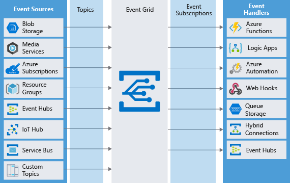

# Message Brokers. 

## Обзор.

Message Brokers - это сервис, который хранит сообщения, переданные ему одним приложением (продьюсером)
пока их не заберет другой приложение (консьюмер).
Он может работать с несколькими приложениями-продьюсерами и несколькими приложениями-консьюмерами.
Основное преимущество Message Broker-а в том, что он инкапсулирует и позволяет настраивать внутри себя логику
доставки сообщения от продьюсера к консьюмеру. 
Это позволяет:
* организовать слабую связанность между приложениями: приложение-продьюсер ничего не знает о 
  приложении-консьюмере. Единственное, о чем знают оба приложения - это формат передаваемого 
  сообщение и то это может быть не всегда, т.к. может передаваться обычная строка или бинарные 
  данные
* организовать асинхронный обмен сообщениями между приложениями: приложение-продьюссе не ждет 
  пока приложение-консьюмер ответит
* организовать отправку одного сообщения нескольким приложениям-консьюмерам
* организовать публикацию несколькими приложениями-продьюсерами сообщений в одну и ту же входную 
  точку

## Message vs Event

Важно четко различать разницу между Message и Events:
* Message - сообщение, это сущность, которая:
  * содержит информацию, которую продьюсер хочет передать консьюмеру
  * адресовывается определенному консьюмеру/-ам - направленная рассылка
* Event - событие, это сущность, которая:
  * сигнализирует о том, что что-то случилось. Не содержит в себе информацию или содержит только 
    ссылку на место, где храниться информация
  * адресант не определен - может быть доставлено как одному/нескольким консьюмерам, так и не 
    доставлена вообще - часто используется для бродкстинга

Различия описаны в статье [Choose whether to use messages or events](https://learn.microsoft.com/en-us/training/modules/choose-a-messaging-model-in-azure-to-connect-your-services/2-choose-whether-to-use-message-queues-or-events)
Понимание различия позволяет выбирать тип отправляемой сущности, и, как следствие, инструмент 
(Message broker) MS Azure для отправки/получения сущности (описал в следующей главе). 

## Message Brokers в Microsoft Azure
В Microsoft Azure присутствуют следующие типы Message Brokers:
* Event Grid - лучший выбор для Reactive Programming (например, WebFlux). Приложение-продьюсер 
  генерирует событие, а одно или несколько приложений-консьюмеров выполняют какое-то действие 
  (реагируют) на приход этого сообытия. События никак не связаны друг с другом.
* Event Hub - необходимо использовать при обработке Big Data pipeline. Например, это могут быть 
  данные от IoT устройств или данные от различных датчиков телеметрии (пожарная защита, 
  мониторинг дорожного трафика и т.д.)
* Service Bus - используется для пересылки очень важных бизнес-сообщений (именно сообщений, а не 
  событий), потеря которых 
  критична (финансовые тразакции, обработка заказов и т.д.). Может обеспечивать строгую 
  последовательность передачи сообщений (FIFO), 
  сессионность, 
  транзакционность. Ограничена 80 GB пространства для одной единицы хранения сообщений (например,
  для одной очереди)
* Storage Queue - довольно похожа на Service Bus, работает быстрее, отсутствует ограничение на 
  80 GB на единицу хранения, не поддерживает FIFO

## Преимущества очередей
Очереди в различных брокерах сообщений могут предоставлять следующие преимущества:
* Увеличивают надежность доставки сообщений
* Гарантируют доставку сообщений. Виды гарантий:
  * At-Least-Once Delivery - хотя бы одному из сабскрайберов. Но при этом есть вероятность того, 
    что сообщение будет доставлено более чем одному сабскрайберу. Например, одни из 
    сабскрайберов забрал сообщение на обработку, но потом завис и не отметил, что сообщение 
    обработано. Через какой-то таймаут очередь пометить сообщение как не взятое в работу и его 
    возьмет в обработку другой сабскрайбер 
  * At-Most-Once Delivery - сообщение будет доставлено только один раз. В данном случае 
    гарантируется то, что сообщение не будет доставлено больше чем одни раз, но появляется 
    вероятность того, что сообщение вообще не будет доставлено.
  * First-In-First-Out (FIFO) -гарантия последовательности доставки сообщений. Имеет другую 
    логическую наполненность, чем первые 2, записал сюда, потому-то так указано в статье.
* Поддерживает транзакционность - это значит, что несколько сообщений объединяются в группу и 
  могут быть обработаны либо все вместе, либо, если одно из них не будет обработано, то и 
  обработка остальных откатывается. Например, пользователь выполнил заказ, который породил 3 
  сообщения: в систему обработки платежей, в систему выставления счетов, в систему хранения 
  заказов. Нужно, чтобы обработались все 3 сообщения 3-мя системами, или все 3 не были обработаны.

## Service Bus vs Storage Queue. Когда какую использовать?
Оба инструмента похожи, причем Service Bus предоставляет возможность рассылки сообщений с 
помощью 2-х механизмов:
* Topic+Subscription
* Queue

Использую Service Bus Topic+Subscription когда:
* каждое из сообщений должны обрабатывать несколько сабскрайберов

Использую Service Bus Queue когда:
* нужна гарантия At-Most-Once
* нужна гарантия FIFO 
* нужна гарантия транзакционности
* хочу получать сообщение без опроса очереди
* необходимо обеспечить авторизацию при доступе к очереди
* нужно обрабатывать сообщение больше 64 KB, но меньше 100 MB
* размер очереди не превышает 1TB
* есть необходимость публиковать и обрабатывать пакеты сообщений

Использую Storage Queue когда:
* нужно журналировать все сообщения, которые проходят через очередь
* размер очереди может быть больше 1TB
* необходимо отслеживать прогресс обработки сообщений в очереди

## Event Grid. Когда использовать?
Event Grid нужно использовать для рассылки именно событий (не сообщений, а событий). Event Grid 
предназначена для того, чтобы один из элементов системы мог выслать оповещение о том, что внутри 
него что-то случилось нулю, одному или n другим элементом системы. Назначение Event Grid хорошо 
отображено на следующем изображении:

Большинство типов компонентов MS Azure имеют уже встроенный функционал как для рассылки событий, 
так и для получения событий. Кроме этого Event Grid обладает API (в том числе и REST) рассылки и 
получения сообщений из приложений. 
Использую Event Grid когда:
* необходимо отправлять именно события, а не сообщения
* необходима простота в отправке событий
* необходима возможность расширенной фильтрации событий
* необходима возможность широкого и гибкого ветвления: сообщение может быть послано от большого 
  количества приложений и принято большим количество приложений
* необходима надежность доставки: Event Grid выполняет попытки доставки события в течение 24 часов
* необходима тарификация за факт отправки события, а не за физический ресурс (например, виртуальную 
  машину)

Подробнее можно почитать в статье [Choose Azure Event Grid](https://learn.microsoft.
com/en-us/training/modules/choose-a-messaging-model-in-azure-to-connect-your-services/4-choose
-event-grid) и в документе [Event Grid](./Event%20Grid/Event%20Grid.md)

## Event Hub. Когда использовать?
Используется для обработки так называемого Big Data - сплошного потока информации (событий) от 
большого количества источников, который нужно обрабатывать в режиме реального времени для целей 
мониторинга, выявления аномальных ситуаций, оповещения, построения графиков. Примером такого поток 
событий 
может служить система пожарной безопасности, система контроля и мониторинга работы двигателя 
самолета, сбор финансовой истории людей и т.д.
На основании Event Hub строятся пайплайны для обработки этого потока данных.
Event Hub разбивает события на партиции - буферы, в которых события накапливаются. Подписчик 
читает сразу всю партицию, а не события по одному. По умолчанию в случае, если события не 
прочитаны подписчиком, они остаются в буфере 24 часа, после чего удаляются. Каждая партиция 
обрабатывается отдельной группой подписчиков.
Использую Event Hub когда:
* необходимо поддерживать большое количество аутентифицированных паблишеров
* необходимо сохранять поток событий в Data Lake или Blob storage
* необходимо агрегировать или анализировать поток событий
* необходим надежный и отказоустойчивый обмен сообщениями

Подробнее можно почитать в статье [Choose Azure Event Hubs](https://learn.microsoft.com/en-us/training/modules/choose-a-messaging-model-in-azure-to-connect-your-services/5-choose-azure-event-hubs)